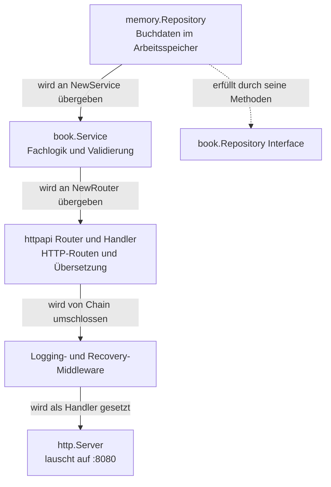
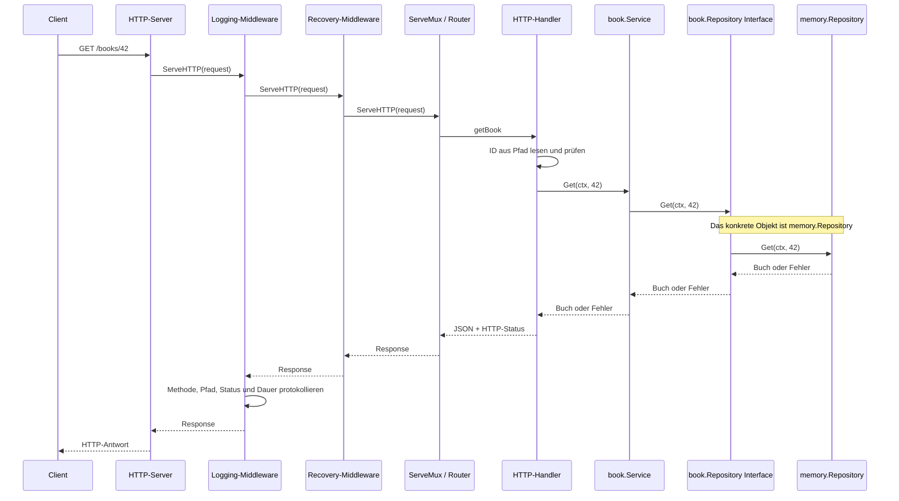

# Request- und Antwortfluss

Es hilft, zwei Dinge auseinanderzuhalten:

1. **Beim Start** werden die Komponenten miteinander verbunden.
2. **Bei einer Anfrage** wandern Request und Response durch diese Komponenten.

## 1. Wie die Anwendung zusammengesetzt wird

In `cmd/api/main.go` werden die Bausteine in dieser Reihenfolge erstellt:



Die gestrichelte Linie bedeutet: `memory.Repository` deklariert nicht ausdrücklich `implements`. In Go erfüllt ein Typ ein Interface automatisch, wenn er dessen Methoden besitzt.

## 2. Weg einer Anfrage

Beispiel: Der Client fragt `GET /books/42` ab.



Die Anfrage läuft von außen nach innen:

```text
Client → HTTP-Server → Logging → Recovery → Router → Handler
       → Service → Repository-Interface → Memory-Repository
```

Die Antwort kehrt durch dieselben Aufrufe zurück. Das ist kein separater zweiter Durchlauf: Die verschachtelten Funktionsaufrufe werden zurückgegeben. Darum kann die Logging-Middleware nach der Bearbeitung den Status und die Dauer protokollieren.

## Zuständigkeiten und Fehler

- **Router:** wählt anhand von HTTP-Methode und Pfad den passenden Handler. Zum Beispiel wird `GET /books/{id}` an `getBook` geleitet.
- **Handler:** verarbeitet HTTP-Ein- und -Ausgabe. Er liest und prüft die ID, ruft den Service auf und formt das Ergebnis zur HTTP-Antwort, meist JSON.
- **Service:** führt die Fachlogik aus. Beim Anlegen und Ändern normalisiert und validiert er die Buchdaten.
- **Repository:** liest oder verändert die gespeicherten Bücher. Der Service spricht dabei das Interface an, nicht direkt die konkrete Speicherart.
- **Middleware:** protokolliert Anfragen und fängt unerwartete Panics ab.

Beispiele für Fehlerwege:

- Eine ungültige ID wird vom Handler direkt als `400 Bad Request` beantwortet; Service und Repository werden dann nicht aufgerufen.
- Ist die ID gültig, aber das Buch nicht vorhanden, kommt `book.ErrNotFound` zurück. Der Handler macht daraus `404 Not Found`.
- Ein Validierungsfehler beim Anlegen oder Ändern wird als `400 Bad Request` beantwortet.
- Ein unerwarteter Fehler wird als `500 Internal Server Error` beantwortet. Bei einer unerwarteten Panic versucht die Recovery-Middleware ebenfalls eine `500`-Antwort zu senden, sofern die Antwort noch nicht begonnen hat.
